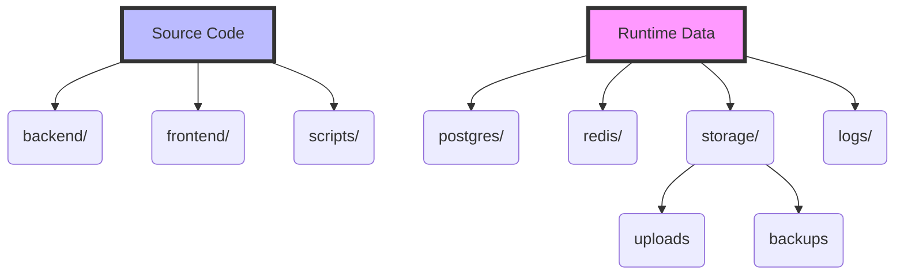

# Tech News Today

Welcome to the Tech News Today repository. 

## Project Architecture

This project is designed with a strict separation between source code and generated runtime data to ensure easy backups, predictable environments, and clean local development.

```text
D:\Projects\
│
├── tech_news\
│
│   ├── backend/         # FastAPI Python Backend
│   ├── frontend/        # NextJS React Frontend
│   ├── docs/            # Architecture & Runbooks
│   ├── scripts/         # Utility and Migration Scripts
│   ├── runtime/         # ⚠️ Git-ignored generated data
│   │
│   │   ├── storage/
│   │   │   ├── uploads/
│   │   │   │   └── thumbnails/
│   │   │   │       ├── original/
│   │   │   │       ├── optimized/
│   │   │   │       └── fallback/
│   │   │   ├── backups/
│   │   │   ├── temp/
│   │   │   └── exports/
│   │   │
│   │   ├── postgres/    # Database volumes
│   │   ├── redis/       # Cache volumes
│   │   ├── logs/        # Application logs
│   │   ├── monitoring/
│   │   └── celery/
│
└── shared/              # Shared assets across projects
    ├── datasets/
    ├── prompts/
    ├── templates/
    └── models/
```

### Understanding the `runtime/` Directory

Everything generated at runtime—including logs, file uploads, database states, and system backups—lives securely inside the `runtime/` folder. This folder is explicitly ignored via `.gitignore` to prevent data leakage and keep Git commits clean. 

**Workflow Diagram:**



## Migration

If you are migrating from an older version using named Docker volumes:
1. Ensure your containers are stopped (`docker compose down`).
2. Run `.\scripts\migrate_runtime.ps1`.
3. Verify your data exists in `./runtime`.
4. Delete the old Docker volumes manually (`docker volume rm tech_news_postgres_data tech_news_redis_data`).
