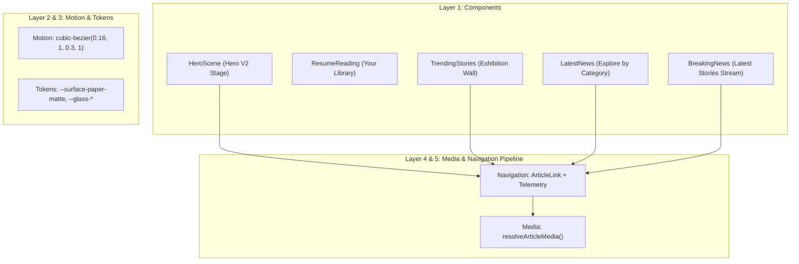

# Final RC3 Baseline Architecture Freeze & Production Execution Plan

> **Status**: Finalized & Ready for Phase 1 Execution  
> **Safety Guarantee**: 100% Static & Reference Analysis verified.  
> **Target Workspace**: `d:\tech_news\frontend`

---

## 1. The 5-Layer RC3 Architecture Freeze

The following contracts are formally frozen as the **RC3 Production Baseline**. No future feature implementations may introduce parallel implementations, un-instrumented raw links, or ad-hoc styling primitives.

### Layer 1: Canonical Component Registry
1. **Hero Stage**: `src/components/home/hero/v2/HeroScene.tsx`
2. **Personal Desk**: `src/components/reading/ResumeReading.tsx`
3. **Exhibition Wall**: `src/components/homepage/TrendingStories/TrendingStories.tsx`
4. **Category Desks**: `src/components/homepage/LatestNews/LatestNews.tsx`
5. **Latest Stream**: `src/components/homepage/BreakingNews/BreakingNews.tsx`

### Layer 2: Motion Easing & Presets
* **Signature Easing**: `cubic-bezier(0.16, 1, 0.3, 1)` (Apple/Arc physical easing across all reveals and panel entries).
* **Non-Reactive 60fps Motion**: High-frequency animation calculations (3D ring rotation and drag inertia) execute via direct DOM manipulation (`requestAnimationFrame` + `style.transform`) to completely bypass React render cycles.

### Layer 3: Design Tokens
* **Paper Surfaces**: `--surface-paper-matte` (`#0D0D0D`)
* **Glass Surfaces**: `--glass-bg-subtle` (`rgba(255,255,255,0.04)`), `--glass-border-subtle` (`rgba(255,255,255,0.08)`)
* **Focus & Accents**: High-contrast monochrome with breaking/live red restricted exclusively to alerts.

### Layer 4: Media Pipeline Contract
* **Canonical Resolver**: `domains/article/media/resolve.ts` (`resolveArticleMedia`).
* **Contract**: All article cards must resolve media through `resolveArticleMedia(article)` to guarantee CDN fallback and optimization. Raw property access (`thumbnail_url`, `hero_image`) is deprecated.

### Layer 5: Navigation & Telemetry Contract
* **Canonical Link**: `domains/article/ArticleLink.tsx`.
* **Contract**: All article navigation routes must use `<ArticleLink article={article}>` to enforce `article_click` telemetry tracking and seamless page transition context.

---

## 2. Incremental Execution Plan (Phases 1 – 6)

### Phase 1: Zero-Risk Dead Code Removal
Safely delete the 15 verified orphan files (`.bak`, V1 Hero components, V2 prototypes, checked-in ZIPs, and unused assets).

### Phase 2: Checkpoint Build #1
Execute `npm run build` and `npx tsc --noEmit` to verify zero regression after file deletion.

### Phase 3: Navigation Contract Normalization
Migrate all 7 raw `<Link href={`/articles/...`}>` occurrences (`TopicCollections`, `RelatedStories`, `FeedClient`, `SemanticRelated`, `entities/[id]`, `topics/[slug]`, `ConversationalSearch`) to canonical `<ArticleLink>`.

### Phase 4: Media Pipeline Normalization
Route raw `thumbnail_url` and `hero_image` property accesses in `StoryCard.tsx`, `ArticlePageClient.tsx`, and `topics/[slug]/page.tsx` through `resolveArticleMedia(article)`.

### Phase 5: Server Component & Lazy Import Optimization
Incrementally convert static skeletons (`HeroSkeleton`, `EditorialCardSkeleton`) to Server Components and dynamically import heavy modals (`GlobalSearchOverlay`, `SettingsDialog`, `ConversationalSearch`).

### Phase 6: Final Production Checkpoint Build
Execute final production build, typecheck, and freeze RC3 baseline.
