# Tech News Today — System Architecture Diagram (v1.0.0 Frozen Baseline)

## Architecture Overview

```mermaid
flowchart TD
%% ─────────────────────────────────────────────────────────────────────────────
%% STYLES & DEFINITIONS
%% ─────────────────────────────────────────────────────────────────────────────
    classDef controlPlane fill:#f8f9fa,stroke:#6c757d,stroke-width:2px,stroke-dasharray: 5 5,color:#212529;
    classDef presentation fill:#e8f4fd,stroke:#0d6efd,stroke-width:2px,color:#084298;
    classDef intelligence fill:#eef9f0,stroke:#198754,stroke-width:2px,color:#0f5132;
    classDef runtime fill:#fff3cd,stroke:#ffc107,stroke-width:2px,color:#664d03;
    classDef storage fill:#f3e8fd,stroke:#6f42c1,stroke-width:2px,color:#381669;
    classDef external fill:#fde8e8,stroke:#dc3545,stroke-width:2px,color:#842029;
    classDef legendBox fill:#ffffff,stroke:#adb5bd,stroke-width:1px,color:#495057;

%% ─────────────────────────────────────────────────────────────────────────────
%% PLANE 1: ARCHITECTURE GOVERNANCE & CONTROL PLANE
%% ─────────────────────────────────────────────────────────────────────────────
    subgraph GOVERNANCE ["🏗️ Plane 1 — Architecture Governance & Compliance (Control Plane)"]
        ACE_CLI["ACE CLI<br/>(Static AST Analyzer)"]
        ACE_ENGINE["ACE Compliance Engine<br/>(LayerPolicy & Invariant Rules)"]
        CI_GATE["GitHub Actions CI Gate<br/>(pr-gate.yml)"]
        OTEL_PLANE["OpenTelemetry Collector & Tracer<br/>(Business Spans & Whitelisted Attributes)"]

        ACE_CLI --> ACE_ENGINE
        ACE_ENGINE --> CI_GATE
    end

%% ─────────────────────────────────────────────────────────────────────────────
%% PLANE 2: PRODUCT EXPERIENCE & SECURITY BOUNDARY
%% ─────────────────────────────────────────────────────────────────────────────
    subgraph PRODUCT ["💻 Plane 2 — Product Experience & Security Boundary"]
        CLIENT_APP["Next.js Web Application<br/>(Article Reader, Curation, Ops Console)"]
        AUTH_GATEWAY["Auth & Session Interceptor<br/>(JWT Verification & RBAC Middleware)"]
        FASTAPI_ROUTER["FastAPI Application Boundary<br/>(v1 / v2 REST API & Lifespan Hooks)"]

        CLIENT_APP -->|"HTTPS / API Requests"| AUTH_GATEWAY
        AUTH_GATEWAY -->|"Authenticated & Authorized Context"| FASTAPI_ROUTER
    end

%% ─────────────────────────────────────────────────────────────────────────────
%% PLANE 3: CONTENT INTELLIGENCE & DOMAIN FORMATION
%% ─────────────────────────────────────────────────────────────────────────────
    subgraph INTELLIGENCE ["🧠 Plane 3 — Content Intelligence Pipeline"]
        EXT_SOURCES["External Publishers & Feeds<br/>(RSS / Atom / Web Sources)"]:::external
        ACQUISITION["Acquisition Engine<br/>(SSRF Protection, Robots & ETag Poller)"]
        INGESTION["Ingestion Processor<br/>(Sanitizer, Deduplication & Read Model)"]
        AI_ENRICHMENT["AI Enrichment Service<br/>(Categorization, Summary & Sentiment)"]
        AI_PROVIDERS["AI Provider Adapters<br/>(OpenAI, Anthropic, Mock Fallback)"]:::external
        
        KNOWLEDGE_EVO["Knowledge Evolution Engine<br/>(Entity & Relationship Extraction)"]
        STORY_FORMATION["Story Formation & Evolution<br/>(Clustering, Timelines & Lead Assignment)"]

        EXT_SOURCES -->|"Feed Fetch"| ACQUISITION
        ACQUISITION -->|"Raw Document"| INGESTION
        INGESTION -->|"Cleaned Article"| AI_ENRICHMENT
        AI_ENRICHMENT <-->|"Task Request / Structured Output"| AI_PROVIDERS
        AI_ENRICHMENT -->|"Enriched Context"| KNOWLEDGE_EVO
        AI_ENRICHMENT -->|"Enriched Context"| STORY_FORMATION
    end

%% ─────────────────────────────────────────────────────────────────────────────
%% PLANE 4: EDITORIAL ASSEMBLY & MULTI-CHANNEL DISTRIBUTION
%% ─────────────────────────────────────────────────────────────────────────────
    subgraph EDITORIAL ["📰 Plane 4 — Editorial Assembly & Personalization"]
        EDITORIAL_CURATION["Editorial Assembly OS<br/>(Drafts, Reviews & Fact-Checking)"]
        RECS_PIPELINE["Personalization & Recommendations<br/>(Scoring, Diversity & User Signals)"]
        CONTENT_SELECTION["Curated Content Artifact<br/>(Publication Certificate)"]
        
        DIST_CHANNELS["Distribution Engine<br/>(Newsletter Campaigns, RSS, Webhooks)"]

        EDITORIAL_CURATION --> CONTENT_SELECTION
        RECS_PIPELINE -->|"Personalized Feeds"| FASTAPI_ROUTER
        CONTENT_SELECTION -->|"Homepage Materialization"| FASTAPI_ROUTER
        CONTENT_SELECTION -->|"Campaign Trigger"| DIST_CHANNELS
    end

%% ─────────────────────────────────────────────────────────────────────────────
%% PLANE 5: PLATFORM RUNTIME & CQRS EVENT BUS
%% ─────────────────────────────────────────────────────────────────────────────
    subgraph RUNTIME ["⚙️ Plane 5 — Platform Runtime & Asynchronous Event Processing"]
        FASTAPI_EXEC["FastAPI Runtime Workers"]
        OUTBOX_TABLE[("Transactional Event Outbox<br/>(State: CREATED / LEASED / DELIVERED)")]
        DISPATCHER["Event Dispatcher Task<br/>(CTE + FOR UPDATE SKIP LOCKED)"]
        REDIS_BROKER[("Redis Message Broker & Distributed Cache")]
        CELERY_WORKERS["Celery Asynchronous Workers<br/>(Parallel Task Processing)"]
        
        CQRS_PROJECTORS["Targeted CQRS Projectors<br/>(Article, Story, Entity, Thumbnail)"]
        CHECKPOINT_GUARD[("Outbox Dispatch Checkpoints<br/>(UNIQUE: handler_name, outbox_event_id)")]

        FASTAPI_EXEC -->|"Domain Write + Outbox Event (Atomic Transaction)"| OUTBOX_TABLE
        DISPATCHER -->|"Claim Batch Leases & Reclaim Expired"| OUTBOX_TABLE
        DISPATCHER -->|"Publish Async Job"| REDIS_BROKER
        REDIS_BROKER -->|"Consume Task"| CELERY_WORKERS
        CELERY_WORKERS -->|"Execute"| CQRS_PROJECTORS
        CQRS_PROJECTORS <-->|"Check & Record Effect Idempotency"| CHECKPOINT_GUARD
    end

%% ─────────────────────────────────────────────────────────────────────────────
%% PLANE 6: UNIFIED PERSISTENCE STORE
%% ─────────────────────────────────────────────────────────────────────────────
    subgraph STORAGE ["🗄️ Plane 6 — Unified PostgreSQL Persistence Store"]
        direction TB
        subgraph PG_STORE ["PostgreSQL Database (Primary Relational & Extensions)"]
            PG_DOMAIN[("1. Domain Entities Store<br/>(Articles, Stories, Drafts, Users)")]
            PG_GRAPH[("2. Knowledge Graph Engine<br/>(Entities, Links, Relationship Edges)")]
            PG_VECTORS[("3. pgvector Semantic Embeddings<br/>(HNSW Index, Article Vector Embeddings)")]
            PG_PROV[("4. AI Provenance Records<br/>(Immutable AIInferenceRecord Forensics)")]
            PG_READ_MODELS[("5. Materialized Read Models<br/>(Homepage, Feed Caches, Analytics)")]
        end

        BACKUP_SERVICE["Backup & Disaster Recovery<br/>(Local Storage / Gzip Compressed Archives)"]
        PG_STORE -.->|"Scheduled Snapshots"| BACKUP_SERVICE
    end

%% ─────────────────────────────────────────────────────────────────────────────
%% CROSS-PLANE DATA FLOW CONNECTIONS
%% ─────────────────────────────────────────────────────────────────────────────
    INGESTION -->|"Persist Raw Article"| PG_DOMAIN
    KNOWLEDGE_EVO -->|"Persist Graph + Forensics"| PG_GRAPH
    KNOWLEDGE_EVO -->|"Link AI Record"| PG_PROV
    STORY_FORMATION -->|"Persist Story Entities"| PG_DOMAIN
    AI_ENRICHMENT -->|"Persist Vectors"| PG_VECTORS

    FASTAPI_ROUTER -->|"Query Fast Path"| PG_READ_MODELS
    CQRS_PROJECTORS -->|"Materialize & Synchronize"| PG_READ_MODELS
    PG_READ_MODELS -.->|"Cold Cache Fallback"| REDIS_BROKER

%% ─────────────────────────────────────────────────────────────────────────────
%% CROSS-CUTTING GOVERNANCE & OBSERVABILITY (DASHED CONTROL LINES)
%% ─────────────────────────────────────────────────────────────────────────────
    ACE_ENGINE -.->|"AST Capability Enforcement"| PRODUCT
    ACE_ENGINE -.->|"AST Capability Enforcement"| INTELLIGENCE
    ACE_ENGINE -.->|"AST Capability Enforcement"| RUNTIME

    OTEL_PLANE -.->|"Distributed Context & Business Spans"| PRODUCT
    OTEL_PLANE -.->|"Distributed Context & Business Spans"| INTELLIGENCE
    OTEL_PLANE -.->|"Distributed Context & Business Spans"| RUNTIME

%% ─────────────────────────────────────────────────────────────────────────────
%% DIAGRAM LEGEND
%% ─────────────────────────────────────────────────────────────────────────────
    subgraph LEGEND ["📋 Diagram Legend"]
        L_DATA["Solid Line ────────▶ : Direct Runtime & Data Flow"]:::legendBox
        L_CTRL["Dashed Line - - - -▶ : Governance, Control Plane & Tracing"]:::legendBox
        L_CYL[("Cylinder : Persistent Database & Event Store")]:::legendBox
        L_EXT["Red Box : External 3rd-Party Systems"]:::external
    end

%% ─────────────────────────────────────────────────────────────────────────────
%% CLASS ASSIGNMENTS
%% ─────────────────────────────────────────────────────────────────────────────
    class ACE_CLI,ACE_ENGINE,CI_GATE,OTEL_PLANE,GOVERNANCE controlPlane;
    class CLIENT_APP,AUTH_GATEWAY,FASTAPI_ROUTER,PRODUCT presentation;
    class ACQUISITION,INGESTION,AI_ENRICHMENT,KNOWLEDGE_EVO,STORY_FORMATION,INTELLIGENCE intelligence;
    class EDITORIAL_CURATION,RECS_PIPELINE,CONTENT_SELECTION,DIST_CHANNELS,EDITORIAL intelligence;
    class FASTAPI_EXEC,OUTBOX_TABLE,DISPATCHER,REDIS_BROKER,CELERY_WORKERS,CQRS_PROJECTORS,CHECKPOINT_GUARD,RUNTIME runtime;
    class PG_DOMAIN,PG_GRAPH,PG_VECTORS,PG_PROV,PG_READ_MODELS,PG_STORE,BACKUP_SERVICE,STORAGE storage;
```

---

## Architectural Planes & Contract Map

### 1. Architecture Governance & Control Plane
- **ACE Engine:** Analyzes Python ASTs across all modules and verifies capability boundaries (`Domain` $\leftarrow$ `Application` $\leftarrow$ `Interface`). Enforced via CI in `.github/workflows/pr-gate.yml`.
- **OpenTelemetry:** Auto-instruments incoming HTTP, SQL queries, Redis cache hits, and Celery jobs. Business spans record high-level operational telemetry (`outbox.dispatch_batch`, `article.enrichment`, `article.knowledge_extraction`) without logging raw sensitive payloads.

### 2. Product Experience & Security Boundary
- **Client Tier:** Next.js Application (App Router) executing on edge / browser runtime.
- **Authentication Gateway:** Session interceptor validating JWT tokens and enforcing Role-Based Access Control (RBAC: `READER`, `CURATOR`, `EDITOR`, `ADMIN`).
- **Interface Tier:** FastAPI routes isolated from database internals, interacting exclusively with Application services.

### 3. Content Intelligence Pipeline
- **Acquisition:** RSS/Atom poller with strict SSRF protection, robots.txt compliance, and conditional headers.
- **Ingestion:** Content sanitization (XSS filtering, boilerplate removal, attribute normalization).
- **AI Enrichment:** Abstracted multi-provider service with strict rate limiting, token usage monitoring, cost calculation, and caching.
- **Knowledge Graph:** Entity, Topic, Timeline, and Relationship extraction with immutable forensic provenance (`AIInferenceRecord`).
- **Story Formation:** Semantic clustering into persistent, evolving stories.

### 4. Editorial Assembly & Personalization
- **Editorial OS:** Git-like versioned draft patches, peer review queues, fact-checking, and signed publication certificates.
- **Recommendation Engine:** 8-stage personalization pipeline driven by user profile signals.
- **Multi-Channel Distribution:** Curated content feeds both the high-performance Homepage read model and external distribution channels (Newsletter campaigns, RSS feeds, Webhooks).

### 5. Platform Runtime & CQRS Event Bus
- **Transactional Outbox:** Domain writes and event insertions execute within the same database transaction.
- **Leasing Dispatcher:** Claims batches of up to 50 events using PostgreSQL `WITH candidates AS (...) UPDATE ... FROM candidates ... FOR UPDATE SKIP LOCKED` and reclaims expired leases automatically.
- **Asynchronous Execution:** Redis broker coordinates Celery workers for parallel processing.
- **Effect Idempotency:** Checkpoint table (`OutboxDispatchCheckpoint`) ensures that worker retries after crashes do not duplicate side effects.

### 6. Unified PostgreSQL Persistence Store
- **Domain Entities:** Structured operational data (Articles, Stories, Drafts, Editorial reviews).
- **Knowledge Graph:** Nodes, links, and semantic relationship edges.
- **pgvector:** Vector embeddings for semantic similarity and article retrieval.
- **AI Provenance:** Append-only forensic records for AI traceability.
- **Materialized Read Models:** High-performance pre-computed read projections served to readers.
